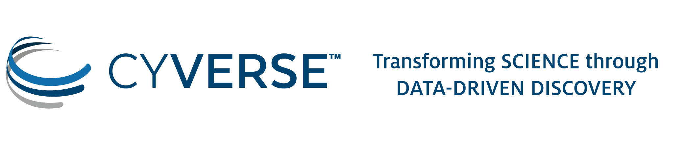

 See instructions in the comments below for how to edit specific sections of this workshop template. 


HEADER

Edit the values in the block above to be appropriate for your workshop.
If the value is not 'true', 'false', 'null', or a number, please use
double quotation marks around the value, unless specified otherwise.
And run 'make workshop-check' *before* committing to make sure that changes are good.




You specified <code>carpentry: {{page.carpentry}}</code> in <code>index.md</code> and
<code>carpentry: {{site.carpentry}}</code> in <code>_config.yml</code>. Make sure you edit both files. After editing <code>_config.yml</code>, you need to run <code>make serve</code> again to
see the changes take effect locally.



<h2 id="general">General Information</h2>

<h4><strong>REGISTRATION:</strong> Please register at: <a href="http://bit.ly/2PBceP7 ">Google Sheet Registration</a></h4>


INTRODUCTION

Edit the general explanatory paragraph below if you want to change
the pitch.










AUDIENCE

Explain who your audience is.  (In particular, tell readers if the
workshop is only open to people from a particular institution.










LOCATION

This block displays the address and links to maps showing directions
if the latitude and longitude of the workshop have been set.  You
can use https://itouchmap.com/latlong.html to find the lat/long of an
address.



  <strong>Where:</strong>
  {{page.address}}.
  Get directions with
  <a href="//www.openstreetmap.org/?mlat={{page.latlng | replace:',','&mlon='}}&zoom=16">OpenStreetMap</a>
  or
  <a href="//maps.google.com/maps?q={{page.latlng}}">Google Maps</a>.




DATE

This block displays the date and links to Google Calendar.



  <strong>When:</strong>
  {{page.humandate}}.
  




SPECIAL REQUIREMENTS

Modify the block below if there are any special requirements.


  <strong>Requirements:</strong> Participants must bring a laptop with a
  Mac, Linux, or Windows operating system (not a tablet, Chromebook, etc.) that they have administrative privileges on. They should have a few specific software packages installed (listed <a href="#setup">below</a>).


CODE OF CONDUCT


<strong>Code of Conduct:</strong>  Everyone who participates in Carpentries activities is required to conform to the <a href="https://docs.carpentries.org/topic_folders/policies/code-of-conduct.html">Code of Conduct</a>. This document also outlines how to report an incident if needed.


ACCESSIBILITY

Modify the block below if there are any barriers to accessibility or
special instructions.


  <strong>Accessibility:</strong> We are committed to making this workshop
  accessible to everybody.
  The workshop organizers have checked that:

<ul>
  <li>The room is wheelchair / scooter accessible.</li>
  <li>Accessible restrooms are available.</li>
</ul>

  Materials will be provided in advance of the workshop and
  large-print handouts are available if needed by notifying the
  organizers in advance.  If we can help making learning easier for
  you (e.g. sign-language interpreters, lactation facilities) please
  get in touch (using contact details below) and we will
  attempt to provide them.


CONTACT EMAIL ADDRESS

Display the contact email address set in the configuration file.


  <strong>Contact</strong>:
  Please email Jason Williams
  
  
  
  or
  
  
  ,
  
  
  <a href='mailto:{{email}}'>{{email}}</a>
  
  
  to-be-announced
  
  for more information about workshop content and Uwe Hilgert, <a href='mailto:hilgert@bio5.org'>hilgert@bio5.org</a> for information on local logistics.


SURVEYS - DO NOT EDIT SURVEY LINKS

<h2 id="surveys">Surveys</h2>

Please be sure to complete these surveys before and after the workshop.



<a href="{{ site.swc_pre_survey }}{{ site.github.project_title }}">Pre-workshop Survey</a>

<a href="{{ site.swc_post_survey }}{{ site.github.project_title }}">Post-workshop Survey</a>



<a href="{{ site.dc_pre_survey }}{{ site.github.project_title }}">Pre-workshop Survey</a>

<a href="{{ site.dc_post_survey }}{{ site.github.project_title }}">Post-workshop Survey</a>



<a href="{{ site.lc_pre_survey }}{{ site.github.project_title }}">Pre-workshop Survey</a>

<a href="{{ site.lc_post_survey }}{{ site.github.project_title }}">Post-workshop Survey</a>




SCHEDULE

Show the workshop's schedule.  Edit the items and times in the table
to match your plans.  You may also want to change 'Day 1' and 'Day
2' to be actual dates or days of the week.

<h2 id="schedule">Schedule</h2>










Collaborative Notes

If you want to use an Etherpad, go to

https://pad.carpentries.org/2019-05-30-uofarizona

where 'YYYY-MM-DD-site' is the identifier for your workshop,
e.g., '2015-06-10-esu'.



  We will use this <a href="{{page.collaborative_notes}}">collaborative document</a> for chatting, taking notes, and sharing URLs and bits of code.




SYLLABUS

Show what topics will be covered.

1. If your workshop is R rather than Python, remove the comment
around that section and put a comment around the Python section.
2. Some workshops will delete SQL.
3. Please make sure the list of topics is synchronized with what you
intend to teach.
4. You may need to move the div's with class="col-md-6" around inside
the div's with class="row" to balance the multi-column layout.

This is one of the places where people frequently make mistakes, so
please preview your site before committing, and make sure to run
'tools/check' as well.

<h2 id="syllabus">Syllabus</h2>










SETUP

Delete irrelevant sections from the setup instructions.  Each
section is inside a 'div' without any classes to make the beginning
and end easier to find.

This is the other place where people frequently make mistakes, so
please preview your site before committing, and make sure to run
'tools/check' as well.


  <h2 id="sponsors">Sponsors</h2>
  
 Thanks to the following sponsors of this workshop

   
  
  
   
  
  

  <h2 id="setup">Setup</h2>
  

  To participate in a Data Carpentry workshop,
  you will need working copies of the software described below.
  Please make sure to install everything and try opening it to make sure it works
  <em>before</em> the start of your workshop. If you run into any problems,
  please feel free to email the instructor or arrive early to your workshop on
  the first day.
  Participants should bring and use their own laptops to insure the proper setup of
  tools for an efficient workflow once you leave the workshop.
  

  <h3 id="General">Accounts needed for workshop</h3>
  
This workshop will be hosted using CyVerse resources.
     <ul><li>Register for a CyVerse account if you have not already done so at <a href="https://user.cyverse.org/">https://user.cyverse.org/</a>.
     <li>Request access to Atmosphere: To request access to Atmosphere, login to the CyVerse User Portal (<a href="https://user.cyverse.org/">https://user.cyverse.org/</a>). In the Services Menu under ‘MY SERVICES’ you should see Atmosphere listed as an option you can launch. If not, look under the Available menu, and click the ‘REQUEST ACCESS’ link. You will receive an email requesting additional information. To qualify for an Atmosphere account, your CyVerse account must be associated with an institutional email address (e.g. .edu/.org/.gov). For justification, you may comment that you are attending the May 2019 workshop at the University of Arizona.
  </ul>

  <h3 id="platform_specfic">Platform-specific Notes</h3>
  
This workshop will be using the software outlined in the install instructions below.
  Please see the section for your operating system for those directions.
  
<ul>
  <li><a href="#windows">Windows</a>
  </li><li><a href="#mac">Mac</a>
  </li><li><a href="#linux">Linux</a>
  </li></ul>

  <h3 id="windows">Windows</h3>
  

  Please go through all the installation steps below and make sure that
  you not only installed them, but start them up to make sure they're working.
  If you have any problems, don't hesitate to email the instructors to
  ask for help, or arrive early on the first day of the workshop to
  get help.
  

  

  <ol>
  <li><b>A spreadsheet program</b></li>
   For this workshop you will need a spreadsheet program. Many people already have
  Microsoft Excel installed, and if you do, you're set!
   
  If you need a spreadsheet
  program, there are a few other options, like OpenOffice and LibreOffice. Install
  instructions for LibreOffice, which is free and open source, are here.
         <ul>
            <li><b>Download the Installer</b>
           Install LibreOffice by going to the <a href="https://www.libreoffice.org/download/libreoffice-fresh/">installation page</a>. The version for Windows
  should automatically be selected. Click <b>Download Version 6.0.3 or later</b>. You
  will go to a page that asks about a donation, but you don't need to make one.
  Your download should begin automatically.
            </li><li><b>Install LibreOffice</b>
               Once the installer is downloaded, double click on it and it should install.
  </li><li>To use LibreOffice, double click on the icon and it will open.
  </li></ul>
  <li><b>Putty</b></li>
   You will need a terminal program to access the AWS Cloud/HPC cluster.
  <ul>
  <li>Go to the Putty <a href="http://www.chiark.greenend.org.uk/%7Esgtatham/putty/download.html">download
  page</a>
  </li><li>Click on <i>putty.exe</i> link to download the install file
  </li><li>To use it, double-click on the downloaded file
  </li><li>Follow any installation instructions, if any
  </li></ul>
  <li><b>FTP Client (Filezilla)</b></li>
   An FTP client will help you transfer files easily between your computer and the cloud.
  <ul>
  <li>Go to the Filezila <a href="https://filezilla-project.org/download.php?show_all=1">download
  page</a>
  </li><li>Chose the download link appropriate to your system
  </li><li>To use it, double-click on the downloaded file
  </li><li>Follow any installation instructions, if any
  </li><li>At the workshop we will give you additional information (e.g. host, username, port) to connect
  </li></ul>
  <li><b>R</b></li>
   In the workshop, we will use RStudio. RStudio is a nice interface to the
  programming language R. To use RStudio, you need to install both R and RStudio.
  <ul>
  <li>      Download R from
        <a href="http://cran.r-project.org/bin/windows/base/release.htm">here</a>
  </li><li>Run the .exe file that was just downloaded
  </li><li>Go to the <a href="http://www.rstudio.com/ide/download/desktop">RStudio Download page</a>
  </li><li>Under <i>Installers</i> select <b>RStudio 1.1.447 or later - Windows XP/Vista/7/8</b>
  </li><li>Double click the file to install it
  </li><li>Once it's installed, open RStudio to make sure it works and you don't get any error messages.
  </li></ul>
  <li><b>IGV</b>
   If time permits, we will use The Broad Institute's IGV (Integrated Genome Viewer) for
  looking at SAM and BAM files, SNPs, and variant calls.
  <ul>
  <li>To download IGV, please visit
  <a href="https://www.broadinstitute.org/software/igv/log-in">this page</a>
   and log in. Please register if you do not already have a login.</li>
  <li>Click on the large button for the Download Binary Distribution</li>
  <li>Find the zip archive on your computer and expand it</li>
  <li>To run IGV, double-click on the IGV.bat file.</li>
  </ul>
  </li></ol>

  <h3 id="mac">Mac</h3>
  

  Please go through all the installation steps below and make sure that
  you not only installed them, but start them up to make sure they're working.
  If you have any problems, don't hesitate to email the instructors to
  ask for help, or arrive early on the first day of the workshop to
  get help.
  

  <ol>
  <li><b>A spreadsheet program</b>
   For this workshop you will need a spreadsheet program. Many people already have
  Microsoft Excel installed, and if you do, you're set!
   
  If you need a spreadsheet
  program, there are a few other options, like OpenOffice and LibreOffice. Install
  instructions for LibreOffice, which is free and open source, are here.
         <ul>
            <li><b>Download the Installer</b>
           Install LibreOffice by going to the <a href="https://www.libreoffice.org/download/libreoffice-fresh/">installation page</a>. The version for Mac
  should automatically be selected. Click <b>Download Version 6.0.3 or later</b>. You
  will go to a page that asks about a donation, but you don't need to make one.
  Your download should begin automatically.
            </li><li><b>Install LibreOffice</b>
               Once the installer is downloaded, double click on it and it should install.
  </li><li>To use LibreOffice, double click on the icon and it will open.
  </li></ul>

  

  
</li><li><b>FTP Client (Filezilla)</b>
   An FTP client will help you transfer files easily between your computer and the cloud.
  <ul>
  <li>Go to the Filezila <a href="https://filezilla-project.org/download.php?show_all=1">download
  page</a>
  </li><li>Chose the download link appropriate to your system
  </li><li>To use it, double-click on the downloaded file
  </li><li>Follow any installation instructions, if any
  </li><li>At the workshop we will give you additional information (e.g. host, username, port) to connect
  </li></ul>
  </li>
  
<li><b>R</b>
   In the workshop, we will use RStudio. RStudio is a nice interface to the
  programming language R. To use RStudio, you need to install both R and RStudio.
  <ul>
  <li>Go to <a href="http://cran.r-project.org/">CRAN</a> and click on <i>Download
  R for (Mac) OS X</i>
  </li><li>Select the .pkg file for the version of OS X that you have and the file
  will download.
  </li><li>Double click on the file that was downloaded and R will install
  </li><li>Go to the <a href="http://www.rstudio.com/ide/download/desktop">RStudio Download page</a>
  </li><li>Under <i>Installers</i> select <b>RStudio 1.1.447 or later - Mac OS X 10.6+ (64-bit)</b> to download it.
  </li><li>Once it's downloaded, double click the file to install it
  </li><li>Once it's installed, open RStudio to make sure it works and you don't get any error messages.
  </li></ul>
  
<li><b>IGV</b></li>
   If time permits, we will use The Broad Institute's IGV (Integrated Genome Viewer) for
  	looking at SAM and BAM files, SNPs, and variant calls.

  <ul>
  <li>To download IGV, please visit
  <a href="https://www.broadinstitute.org/software/igv/log-in">this page</a>
   and log in. Please register if you do not already have a login.</li>
  <li>Click on the large button for the Download Binary Distribution</li>
  <li>Find the zip archive on your computer and expand it</li>
  <li>To run IGV, double-click on the IGV.bat file.</li>
  </ul>

  </li>
</ol>
  <h3 id="linux">Linux</h3>
  

  Please go through all the installation steps below and make sure that
  you not only installed them, but start them up to make sure they're working.
  If you have any problems, don't hesitate to email the instructors to
  ask for help, or arrive early on the first day of the workshop to
  get help.
  

  <ol>
  <li><b>A spreadsheet program</b>
   For this workshop you will need a spreadsheet program. Many people already have
  Microsoft Excel installed, and if you do, you're set!
   
  If you need a spreadsheet
  program, there are a few other options, like OpenOffice and LibreOffice. Install
  instructions for LibreOffice, which is free and open source, are here.
         <ul>
            <li><b>Download the Installer</b>
           Install LibreOffice by going to the <a href="https://www.libreoffice.org/download/libreoffice-fresh/">installation page</a>. The version for Linux
  should automatically be selected. Click <b>Download Version 6.0.3 or later</b>. You
  will go to a page that asks about a donation, but you don't need to make one.
  Your download should begin automatically.
            </li><li><b>Install LibreOffice</b>
               Once the installer is downloaded, double click on it and it should install.
  </li><li>To use LibreOffice, double click on the icon and it will open.
  </li></ul>
  </li><li><b>FTP Client (Filezilla)</b>
   An FTP client will help you transfer files easily between your computer and the cloud.
  <ul>
  <li>Go to the Filezila <a href="https://filezilla-project.org/download.php?show_all=1">download
  page</a>
  </li><li>Chose the download link appropriate to your system
  </li><li>To use it, double-click on the downloaded file
  </li><li>Follow any installation instructions, if any
  </li><li>At the workshop we will give you additional information (e.g. host, username, port) to connect
  </li></ul>

  
<li><b>R</b>
   In the workshop, we will use RStudio. RStudio is a nice interface to the
  programming language R. To use RStudio, you need to install both R and RStudio.
  <ul>
  <li>R is available through most Linux package managers.
  You can download the binary files for your distribution
          from <a href="http://cran.r-project.org/index.html">CRAN</a>. Or
          you can use your package manager (e.g. for Debian/Ubuntu
          run <code>sudo apt-get install r-base</code> and for Fedora run
          <code>sudo yum install R</code>).
  </li><li>To install RStudi, go to the <a href="http://www.rstudio.com/ide/download/desktop">RStudio Download page</a>
  </li><li>Under <i>Installers</i> select the version for your distribution.
  </li><li>Once it's downloaded, double click the file to install it
  </li><li>Once it's installed, open RStudio to make sure it works and you don't get any error messages.
  </li></ul>
  

  
</li>
  
<li><b>IGV</b>
   If time permits, we will use The Broad Institute's IGV (Integrated Genome Viewer) for
  looking at SAM and BAM files, SNPs, and variant calls.
  <ul>
  <li>To download IGV, please visit
  <a href="https://www.broadinstitute.org/software/igv/log-in">this page</a>
   and log in. Please register if you do not already have a login.
  <li>Click on the large button for the Download Binary Distribution
  <li>Find the zip archive on your computer and expand it
  <li>To run IGV, double-click on the IGV.bat file.
